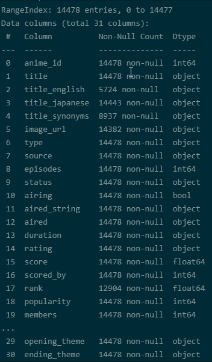
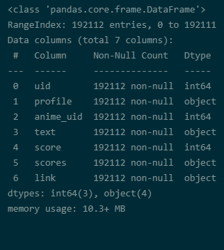

# Studio and Viewership Preferences: Analyzing MyAnimeList's Data
## **by [Tevin Aduma](https://www.linkedin.com/in/tevin-aduma-926803ab/)**

## MyAnimeList Studios and Viewership Dataset

> MyAnimeList is an online platform where all things anime, manga, manhwa or webtoon converge. It's one of the most popular brands that allows _otakus_ keep track of their anime, or manga lists. Regular updates can also be tracked via email and membership platforms.
>
> This dataset encompasses what studio preferences are when it comes to making anime productions as well as the viewership's sentiment towards those productions. 
### Animes Dataset
> Here's a snippet of the **Animes** dataset with a few points on how data was wrangled to fit a cleaner model required for the study.
> 
>
>
#### Wrangling Steps Required

> * The **aired** will have to be engineered to contain only the start date of the anime listings.
>
> * Certain datatypes will have to be changed pertaining to dates, string types and float to ints.
>
> * A number of unrequired columns will be dropped from the dataset; these will not be required in this study i.e. **opening_theme**, **ending_theme**
>
> * Due to the volume of records in this dataset, I will use what I consider to be relevant for this study. Records of anime aired from 1992 to 2018 due to a sense of recency in the trends of the anime industry.
>
> * Dropping all records with any null values will be of utter importance. 
>
> * Feature engineering required for a new column that will capture what **season** the anime was released in. I will use a custom function to generate this information.
>
> * Split the data in the **Genre** column to capture the first stated genre as the main theme of the anime listings.
>
> * Engineer new **ranking** columns based on the volume of **favorites**, **popularity** and **members** for each listing. I will also create a new column that encapsulates the other three ranks on an average scale i.e. **avg_rank_score**
>
> I intend to infer if there is a bias from the viewership that flactuates when it comes to rating anime as well as the studios' preferences when it comes to the rating, timing and themes of their released titles.

### Reviews Dataset
> Here is a snippet of the Reviews dataset and the a summary of the processes taken to impute the data in the required format.
> 
>

#### Wrangling Steps Required

> * Dropping unnecessary columns like `uid`, `profile`
>
> * Renaming the `anime_uid` column to match `anime_id` column in the animes dataset for future merging purposes 
>
> * Unpivoting the data in the scores column to reflect each factor as a feature in the dataset.
>
> * Impute a new **Overall score** to capture the average of all other features made in the review.
>
> * Clean all the data in the `text` field using regex.
>
> * Impute sentiment scores (`polarity`, `subjectivity` and `attitude`) for all review texts.
>
> * Reshaping the dataframe.
>
> * Merging in each anime's title from the Animes dataset. This will ensure for a cleaner look to the dataframe by ensuring anyone assesing it can attune their mind to the scores with the context of what titles are being assessed.## Summary of Findings

> From the exploration of the cleaned datasets, I intend to highlight shifts the volume of productions peaking during the Fall and Spring while noticalbly declining during the Winter. 

> There is a sufficient argument that this has resulted in fewer Winter titles ranking as highly as Fall or Spring titles due to a probable drop in excitement by the anime fanbase. 

> It's worth noting that PG-13 demographic titles are the most popular title rating from the study. This ascertains the viewership prefers the titles to have wranges of content that deal with more mature themes.
## Key Insights for Presentation

> * A major highlight has been the increasing number of productions as time swept by with productions released in the Fall and Spring seeing signficant boosts. It is also noteworthy Winter topped in volume of production in 2005, the year before many notable titles were released in 2006. This visualization will also highlight the mean number of productions through each period i.e. 66.
>
> * TV is the most widely used form of anime adaptation, ONAs are still young in the game and low in numbers VIZ TV releases have been by far the popular medium of release in the anime industry
>
> * Studios with the most productions since the 90s VIZ,  Studio Bones, Madhouse, A-1 Pictures, Kyoto Animation (KyoAni ♥) and J.C. Staff have had the most number of top releases in the last 3 decades compared to the rest of the pack NO VIZ
>
> * **Character Development** and **Enjoyment** have a strong correlation with the outcome of the **Story** score. If an anime does not deliever on the two former features, it's highly likely that it will score quite poorly on the **Story** factor.
>
> * **Animation** and **Music** go hand in hand to a certain degree. This explains why certain action scenes in anime could go for fast-paced upbeat tunes while emotive scenes would require songs along the melancholic to poignant scale.
>
> * The outstanding sentiment left on a viewer could be highly influenced by how the anime scores in the **Character Development**, **Enjoyment** and **Story** features. 
>
>* Studio Gainax's and Tatsunoko Productions's work is highly rated on average amongst the anime community with this being world-renowed **Neon Genesis Evangelion**. This was an **original TV** anime  released in the **Fall**. It's main genre was **Action** and had a rating of **PG-13**. 

 